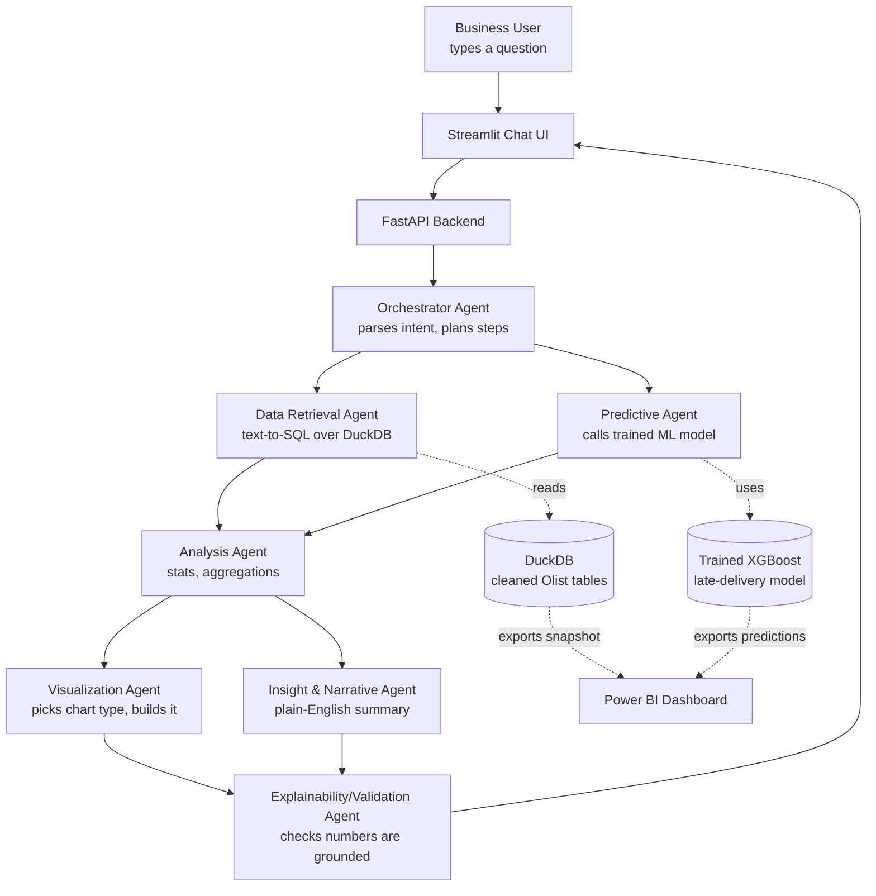

# Multi-Agent Data Analyst for Enterprise Decision Support
### End-to-End Build Plan — Datathon Edition

---

## 1. The Concept, In Plain Terms

A business user types a question like *"Which sellers are causing the most late deliveries this quarter?"* into a chat box. Behind the scenes, a **team of specialized AI agents** — not one giant prompt — splits the work: one figures out what's actually being asked, one pulls the right data, one runs the numbers, one makes the chart, one explains it in plain English with a recommendation. The user never touches SQL, Python, or a BI tool directly.

Your job is to build that pipeline **and** wrap it in a Power BI dashboard so judges see both the "smart" layer (agents) and the "polished" layer (dashboard).

---

## 2. Locked-In Tech Stack

| Layer | Choice | Why |
|---|---|---|
| Agent framework | **CrewAI** | Role-based agents map 1:1 to your problem statement's "specialized agents." Fastest to get working in a time-boxed hackathon. |
| LLM strategy | **Hybrid** (see §5) | Cheap/local model for mechanical steps, strong hosted model for reasoning/narrative — controls cost and gives an offline fallback. |
| Dataset | **Olist Brazilian E-Commerce** (Kaggle) | Real, free, multi-table, maps cleanly to sales/finance/ops/customer-service. |
| Data storage (pipeline) | **DuckDB** | Zero-setup, SQL-queryable, fast on CSVs — perfect for a text-to-SQL retrieval agent. |
| ML model | **scikit-learn / XGBoost** | Classic classifier for the "Prediction Results" deliverable. |
| Explainability | **SHAP** + agent trace logs | Satisfies the "explainable insights" objective directly. |
| Backend | **FastAPI** | Exposes the CrewAI pipeline as an API both the chat UI and Power BI can call. |
| Chat interface | **Streamlit (lightweight companion app)** | Power BI can't host a live chat — see §7 for how these two fit together. |
| Dashboard | **Power BI Desktop (.pbix)** | Your chosen presentation layer. |
| Language | Python 3.11+ | — |

---

## 3. Dataset — Olist Brazilian E-Commerce

**Source:** `kaggle.com/datasets/olistbr/brazilian-ecommerce` — free, no login needed beyond a Kaggle account.

~100k real, anonymized orders (2016–2018), split across 9 linked CSVs:

| File | Contains | Maps to Enterprise Domain |
|---|---|---|
| `olist_orders_dataset.csv` | Order status, timestamps, delivery dates | Sales / Operations |
| `olist_order_items_dataset.csv` | Line items, price, freight per order | Sales |
| `olist_order_payments_dataset.csv` | Payment type, installments, value | **Finance** |
| `olist_order_reviews_dataset.csv` | Star rating + review text | **Customer Service** |
| `olist_customers_dataset.csv` | Customer ID, city, state | Sales / CRM |
| `olist_sellers_dataset.csv` | Seller ID, city, state | **Operations** |
| `olist_products_dataset.csv` | Category, weight, dimensions | Operations / Sales |
| `olist_geolocation_dataset.csv` | Zip → lat/lng | Operations (logistics) |
| `product_category_name_translation.csv` | PT→EN category names | Utility |

This is why it fits the problem statement so well — you get all four business domains (sales, finance, operations, customer service) from one free download, joined by `order_id`, `customer_id`, `seller_id`, `product_id`.

**Alt swap-in options** (if you want a different flavor): AdventureWorks (heavier, SQL-Server-native, more "classic ERP" feel) or a single-domain Superstore sales dataset (smaller scope, less impressive for a multi-domain pitch).

---

## 4. System Architecture



### Agent Roles (CrewAI)

| Agent | Job | LLM tier (see §5) |
|---|---|---|
| **Orchestrator** | Reads the user's question, decides which agents/tools to invoke, in what order | Strong (hosted) |
| **Data Retrieval Agent** | Converts intent into a SQL query against DuckDB, returns raw rows | Light (local) |
| **Predictive Agent** | Wraps the trained classifier as a callable tool — "is order X at risk of late delivery?" | Light (local) |
| **Analysis Agent** | Aggregates/summarizes the retrieved data (means, trends, comparisons) | Light (local) |
| **Visualization Agent** | Chooses chart type + builds it (matplotlib/plotly), or preps a table for Power BI | Light (local) |
| **Insight & Narrative Agent** | Turns numbers into a business-readable answer + recommendation | Strong (hosted) |
| **Explainability/Validation Agent** *(bonus, recommended)* | Double-checks the narrative's claims are actually backed by the retrieved numbers; flags low-confidence predictions | Strong (hosted) |

Build the first 5 as your MVP. Add the 6th (Explainability) if time allows — it directly answers the "Ensure explainability and accuracy" objective and is a strong differentiator in judging.

---

## 5. Hybrid LLM Strategy

Since you want hybrid, split by task difficulty, not randomly:

- **Strong/hosted model** (OpenAI `gpt-4o-mini` or Anthropic Claude Haiku — whichever you have API credits for) → Orchestrator, Narrative, and Validation agents. These need real reasoning and good language quality; the cost is low because you're not sending huge context.
- **Light/local model** (Ollama running `llama3.1:8b` or `mistral:7b`, free, runs on your laptop) → Data Retrieval (text-to-SQL), Analysis, Visualization agents. These are more mechanical/templated tasks, and running them locally means **zero API cost during testing** and a working demo even if wifi or API rate limits fail on stage.

CrewAI lets you assign a different `llm=` per agent directly (it uses LiteLLM under the hood, so `ollama/llama3.1:8b` and `gpt-4o-mini` can sit in the same crew). Install Ollama once, pull the model, and you're set:
```bash
ollama pull llama3.1:8b
```

---

## 6. The Predictive ML Model

The problem statement explicitly wants "Machine Learning / AI Model" + "Prediction Results" as deliverables — this is separate from the LLM agents and feeds the **Predictive Agent** above.

**Recommended target: Late Delivery Risk (binary classification)**
- Predict whether an order will arrive after its estimated delivery date, using features available *before* delivery: seller location, customer location, product weight/category, freight value, order-to-approval time, day of week ordered, etc.
- Ground truth: compare `order_delivered_customer_date` vs `order_estimated_delivery_date` in `olist_orders_dataset.csv`.
- Evaluate with Accuracy, Precision, Recall, F1, ROC-AUC — matches the workflow poster's step 7 exactly.
- Bonus/stretch target: predict low review score risk (1–2 stars) from order/delivery features, since `olist_order_reviews_dataset.csv` gives you the label.

This model becomes a tool the Predictive Agent calls, so a user can ask *"Which current orders are at risk of arriving late?"* and get a live, ranked answer.

---

## 7. How Power BI and the Chat Agents Actually Fit Together

Being upfront about a constraint: **Power BI can't host a live conversational agent** — it's a reporting/visualization tool, not a chat runtime. So the architecture uses Power BI for what it's best at, and a small companion app for the conversational piece:

1. **Power BI Dashboard** (your chosen deliverable) — connects to CSV/Parquet snapshots exported by the pipeline after each run: cleaned Olist tables + prediction results. Build report pages per domain: *Sales Overview*, *Finance/Payments*, *Operations/Logistics (with the late-delivery risk scores)*, *Customer Service/Reviews*. This alone satisfies the "Dashboard/Visualization" deliverable.
2. **Streamlit chat app** (small, ~1 file) — the actual "ask a question, get an answer" interface required by the objective "build an interface that allows non-technical users to interact with the system easily." It calls your FastAPI backend, which runs the CrewAI crew.
3. **Tie them together for the demo:** embed the Streamlit app's URL inside the Power BI report using a **Web content** visual on an "Ask AI" page — so judges see one unified report with a live chat panel next to the charts, even though it's two apps under the hood.

**Practical tip:** don't fight Power BI's DuckDB connectivity — export clean tables to CSV/Parquet in a fixed folder after each pipeline run, and point Power BI at that folder ("Get Data → Folder"). It refreshes with one click and avoids ODBC driver headaches mid-hackathon.

---

## 8. Phase-by-Phase Plan (mapped to your 10-step workflow)

### Phase 1 — Dataset Release
- **Do:** Download Olist from Kaggle, read the column-level docs on the Kaggle page, load all 9 CSVs into a `raw/` folder.
- **Tools:** Kaggle account, `kaggle` CLI or manual download, Jupyter/VS Code notebook.
- **Output:** `raw/*.csv` + a one-page notes file on what each table contains.

### Phase 2 — Understand the Problem
- **Do:** Re-read the problem statement's objectives, decide your MVP scope (5 agents minimum, 6th optional), pick your predictive target (late delivery — §6), define what "success" looks like for the demo (a judge asks a question live and gets a correct, explained answer).
- **Tools:** Just a doc/notion page — no code yet.
- **Output:** A one-pager: scope, success criteria, chosen ML target.

### Phase 3 — Data Cleaning
- **Do:** Handle missing `order_delivered_customer_date` (cancelled/undelivered orders), fix data types (dates as datetime, IDs as string not int), remove duplicate order_items, join tables into a few clean master tables (`orders_master`, `payments_master`, `reviews_master`).
- **Tools:** `pandas`, load into **DuckDB** for SQL-based joins/cleaning at scale.
- **Output:** `clean/*.parquet` + `pipeline/01_clean.py`.

### Phase 4 — Exploratory Data Analysis (EDA)
- **Do:** Distribution of delivery times, late-delivery rate by state/seller, payment method mix, review score distribution, correlation between freight value and review score.
- **Tools:** `pandas`, `matplotlib`/`seaborn`/`plotly` in a notebook.
- **Output:** `notebooks/02_eda.ipynb` with 8–10 key charts + written observations (these observations become talking points in your final presentation).

### Phase 5 — Feature Engineering
- **Do:** Build the feature table for the late-delivery model: distance proxy (seller state vs customer state), order-to-approval time, freight-to-price ratio, product weight/volume, day-of-week, month (seasonality), seller's historical late-delivery rate.
- **Tools:** `pandas`, `scikit-learn` preprocessing (encoders, scalers).
- **Output:** `features/model_features.parquet` + `pipeline/03_features.py`.

### Phase 6 — Model Building
**6a — The ML model:**
- **Do:** Train/compare Logistic Regression (baseline), Random Forest, XGBoost on the late-delivery features. Handle class imbalance (SMOTE or class weights, since most deliveries are on time).
- **Tools:** `scikit-learn`, `xgboost`, `imbalanced-learn`.
- **Output:** `models/late_delivery_xgb.pkl`.

**6b — The agent system:**
- **Do:** Stand up the 5–6 CrewAI agents from §4. Give the Retrieval Agent a text-to-SQL tool over DuckDB, give the Predictive Agent a tool that loads `late_delivery_xgb.pkl` and scores orders, wire the Orchestrator to route between them.
- **Tools:** `crewai`, `crewai-tools`, `litellm`, Ollama (local model).
- **Output:** `agents/crew.py` + a working CLI test: ask a question in the terminal, get a routed answer.

### Phase 7 — Model Evaluation
- **Do:** Evaluate the classifier on a held-out test set (Accuracy, Precision, Recall, F1, ROC-AUC, confusion matrix). Run SHAP to explain which features drive late-delivery predictions. Separately, "evaluate" the agent system qualitatively: run 15–20 sample business questions through it and log whether the answer was correct/grounded.
- **Tools:** `scikit-learn.metrics`, `shap`.
- **Output:** `reports/model_evaluation.md` with metrics table + SHAP summary plot + agent QA log.

### Phase 8 — Business Insights
- **Do:** Turn Phase 4/7 findings into 4–6 concrete, actionable statements — e.g. *"Sellers in state X have 2.3x the late-delivery rate of the national average — prioritize logistics review there."* This is what your Narrative Agent should be capable of generating live, not just something you write by hand.
- **Tools:** Your own analysis + the Insight Agent's output as a live demo of the same capability.
- **Output:** `reports/business_insights.md` (doubles as content for your final PPT).

### Phase 9 — Dashboard Development
- **Do:** Build the Power BI report per §7 — Sales, Finance, Operations (with risk scores), Customer Service pages, plus an "Ask AI" page embedding the Streamlit chat via a Web content visual.
- **Tools:** Power BI Desktop, exported CSV/Parquet snapshots from the pipeline.
- **Output:** `dashboard/DatathonDashboard.pbix`.

### Phase 10 — Prototype / Solution Delivery
- **Do:** Wire FastAPI + Streamlit + Power BI into one demo-able flow. Rehearse the live-question demo (have 3–4 pre-tested questions ready in case of API hiccups — fall back to the local Ollama model if the hosted API fails on stage). Package everything.
- **Tools:** `fastapi`, `uvicorn`, `streamlit`.
- **Output:** Working local (or lightly hosted) end-to-end demo.

---

## 9. Suggested Repo Structure

```
multi-agent-analyst/
├── raw/                    # original Olist CSVs
├── clean/                  # cleaned parquet tables (DuckDB source)
├── features/               # model-ready feature tables
├── models/                 # trained .pkl model(s)
├── pipeline/                # 01_clean.py, 02_eda.py, 03_features.py, 04_train_model.py
├── agents/                 # crew.py, tools/ (sql_tool.py, predict_tool.py, chart_tool.py)
├── api/                    # FastAPI app (main.py)
├── chat_ui/                 # streamlit_app.py
├── dashboard/               # DatathonDashboard.pbix, /powerbi_data exports
├── notebooks/               # EDA notebook
├── reports/                 # model_evaluation.md, business_insights.md
└── README.md
```

---

## 10. Explainability & Accuracy Safeguards

This is explicitly in your objectives, so make it visible, not implicit:

- **Model-level:** SHAP values shown for every high-risk prediction ("this order is flagged late because: seller state, high freight ratio, weekend order").
- **Agent-level:** the Narrative Agent must cite the actual numbers it used (e.g., "based on 1,204 orders from Q3"), and the optional Validation Agent cross-checks that the narrative's numbers match what the Retrieval Agent actually returned — a simple grounding check, not a black box.
- **Log everything:** keep a JSON trace of each agent's input/output for every demo question — great for the technical documentation deliverable and for answering judges' "how do you know it's not hallucinating" question on the spot.

---

## 11. Deliverables Checklist (mapped to the problem statement)

| Required Deliverable | What you hand in |
|---|---|
| Source Code | Full repo (pipeline + agents + API + UI) |
| Machine Learning / AI Model | `late_delivery_xgb.pkl` + the CrewAI agent definitions |
| Data Preprocessing Pipeline | `pipeline/01_clean.py` → `03_features.py` |
| Dashboard / Visualization | `DatathonDashboard.pbix` (+ embedded chat page) |
| Technical Documentation | This plan, evolved into a README + `reports/model_evaluation.md` + architecture diagram |
| Presentation (PPT) | Built from `business_insights.md` + dashboard screenshots + architecture diagram |
| Prediction Results | `reports/model_evaluation.md` metrics + a sample "at-risk orders" output table |

---

## 12. Suggested Time Allocation (relative %, adjust to your actual hackathon length)

| Phase | % of total time |
|---|---|
| 1–2: Setup + Understand | 5% |
| 3–5: Clean, EDA, Features | 20% |
| 6: Model + Agents (the core build) | 35% |
| 7–8: Evaluation + Insights | 10% |
| 9: Dashboard | 15% |
| 10: Integration + Demo Prep | 15% |

Rule of thumb: get a **rough end-to-end path working early** (even with dummy/hardcoded pieces), then improve each phase — don't build phase 6 perfectly before touching phase 9, or you risk a great model with no working demo.

---

## 13. Innovative Bonus Features (pick 1–2 if time allows — good differentiators for judging)

- **Auto-generated PPT:** an agent that takes `business_insights.md` and auto-builds slide bullets — nice meta-demo of "AI doing the analyst's job."
- **What-if simulator:** let a user ask *"what if we cut freight cost by 10% in state X — what happens to late-delivery rate?"* and have the Predictive Agent re-score with adjusted features.
- **Proactive alerts:** instead of only answering questions, have an agent scan the latest data on load and proactively surface "3 things you should know today" (e.g., a seller whose late-delivery rate spiked).
- **Multilingual support:** Olist is Brazilian — accept questions in Portuguese or English (LLMs handle this almost for free, but it's an easy visible wow-factor).
- **Voice input** on the Streamlit chat (Whisper API or local) for a flashier live demo.

---

## 14. Common Pitfalls & Demo-Day Tips

- **Don't over-scope the agent count.** 5 solid agents that clearly work beats 8 flaky ones.
- **Cache your demo questions.** Pre-run your 3–4 planned live-demo questions beforehand so you know the exact expected output, then still run them live — if the API hiccups, you can explain what *should* happen.
- **Always have a local fallback.** This is the whole point of the hybrid LLM setup — if hosted API fails on stage wifi, switch the Orchestrator to the local Ollama model.
- **Export Power BI data as a static snapshot before presenting**, don't rely on a live refresh during the demo itself.
- **Time-box the ML model.** A simple, well-evaluated XGBoost model beats a fancier model you didn't have time to validate properly.

---

*Per the hackathon's AI usage note: this plan, any AI-suggested code, and any agent output are starting points — the architecture decisions, feature choices, and final insights should be reviewed and owned by your team.*
